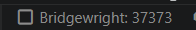

# Bridgewright

Use your local browser from Playwright running in Codespaces.

Bridgewright is a VS Code extension that exposes your Windows Microsoft Edge profile to code running inside your Codespace as a plain Chrome DevTools Protocol endpoint:

```ts
import { chromium } from "playwright";

await chromium.connectOverCDP("http://127.0.0.1:37373");
```

No custom Playwright fixture. No test-code package. No agent-specific API. If code can use Playwright CDP, it can use Bridgewright.

Named CDP profiles are available by adding a profile path to the endpoint:

```ts
await chromium.connectOverCDP("http://127.0.0.1:37373/profiles/kash-work");
```

`default` uses the durable Edge user data directory. Any other valid profile name is session-scoped, stored under `~\.bridgewright\profiles\<name>\edge-user-data`, and removed when Bridgewright starts, stops, or receives a profile close/remove request.

## Quickstart

1. Open this repo in VS Code Desktop connected to a GitHub Codespace.
2. Click the **Bridgewright** status bar item, or run:
   ```text
   Bridgewright: Start Local Browser Bridge
   ```
   
3. Wait for the status bar to show:
   ```text
   Bridgewright: 37373
   ```
4. In the Codespace, connect Playwright. Edge launches lazily on the first real CDP connection:
   ```ts
   import { chromium } from "playwright";

   const browser = await chromium.connectOverCDP("http://127.0.0.1:37373");
   ```

   Use a named profile when a tool such as kash needs isolated browser state:
   ```ts
   const browser = await chromium.connectOverCDP("http://127.0.0.1:37373/profiles/kash-work");
   ```

Agents can check readiness with:

```bash
node .claude/skills/bridgewright/scripts/check-endpoint.js
```

Run the full live smoke from the Codespace after the status bar shows `Bridgewright: 37373`:

```bash
node .claude/skills/bridgewright/scripts/check-endpoint.js --timeout-ms 5000
node .claude/skills/bridgewright/scripts/check-endpoint.js --timeout-ms 20000 --playwright
node .claude/skills/bridgewright/scripts/check-endpoint.js --timeout-ms 20000 --diagnose
curl -fsSL http://127.0.0.1:37373/bridgewright/check-endpoint.js | node - --diagnose --timeout-ms 20000
```

`--diagnose` is repo-independent. If Playwright is not installed in the current repo, the checker still returns `ok: true` when HTTP/CDP health is green and marks the Playwright snapshot as skipped. Use `--playwright` when Playwright attach must be a required gate.

## Commands

- `Bridgewright: Start Local Browser Bridge`
- `Bridgewright: Stop Local Browser Bridge`
- `Bridgewright: Show Status`
- `Bridgewright: Copy CDP Endpoint`
- `Bridgewright: Show Logs`

## State

Windows-side Bridgewright files are stored under:

```text
~\.bridgewright\logs
~\.bridgewright\profiles\<name>\edge-user-data
~\.bridgewright\state.json
```

Only non-default profiles live under `~\.bridgewright\profiles`. Bridgewright deletes that directory on every start and stop so disposable Codespaces cannot leave host-side browser data behind forever. The default Edge profile path is never deleted by Bridgewright.

Codespace-side files are written to:

```text
~/.bridgewright/endpoint.json
~/.bridgewright/status.json
```

Per-run helper files are written inside the active workspace:

```text
.bridgewright-runtime/launch-<run>.sh
.bridgewright-runtime/helper-<run>.log
.bridgewright-runtime/ready-<run>.json
```

## Requirements

- Windows desktop VS Code
- Microsoft Edge
- An open VS Code remote window connected to the target Codespace

## Status bar

- `$(debug-start) Bridgewright` — stopped. Click to start.
- `$(sync~spin) Bridgewright` — arming the Codespace helper.
- `$(debug-stop) Bridgewright: 37373` — armed and waiting for CDP connections. Click to stop.
- `$(warning) Bridgewright` — error. Click to retry after checking logs.

## Troubleshooting

Open **Bridgewright: Show Logs** first. If startup fails before the status bar reaches running, inspect the latest `.bridgewright-runtime/helper-<run>.log` in the Codespace workspace. A healthy helper log includes `BRIDGEWRIGHT_READY`.

If the helper is ready but Playwright cannot connect, run:

```bash
curl --max-time 5 http://127.0.0.1:37373/json/version
curl --max-time 5 http://127.0.0.1:37373/json/list
node .claude/skills/bridgewright/scripts/check-endpoint.js --playwright --timeout-ms 20000
node .claude/skills/bridgewright/scripts/check-endpoint.js --diagnose --timeout-ms 20000
curl -fsSL http://127.0.0.1:37373/bridgewright/check-endpoint.js | node - --diagnose --timeout-ms 20000
```

Profile management endpoints:

```bash
curl http://127.0.0.1:37373/profiles
curl -X POST http://127.0.0.1:37373/profiles/kash-work/close
curl -X POST http://127.0.0.1:37373/profiles/kash-work/remove
```

Profile names must match `[a-zA-Z0-9_][a-zA-Z0-9_.-]{0,63}`. `close` and `remove` are idempotent for named profiles and reject `default`.

## How it works

Bridgewright starts a small helper inside the Codespace that listens on `127.0.0.1:37373`. Start arms the bridge. Your Playwright code connects to that endpoint, and the first CDP bytes trigger local Edge startup. The local VS Code extension connects back through VS Code-forwarded WebSocket tunnels and pipes CDP bytes to Edge.

By default Bridgewright uses the permanent Edge user data root at `%LOCALAPPDATA%\Microsoft\Edge\User Data`. Override `bridgewright.edgeUserDataDir` if you want a dedicated durable default automation profile instead. Named profiles always use Bridgewright-owned ephemeral storage and are cleaned on Bridgewright start and stop.

If the Edge window is closed, Bridgewright closes that CDP socket, keeps the status bar bridge running, and waits for the next incoming connection.

CDP traffic uses sockets. It is never proxied over VS Code command RPC.
